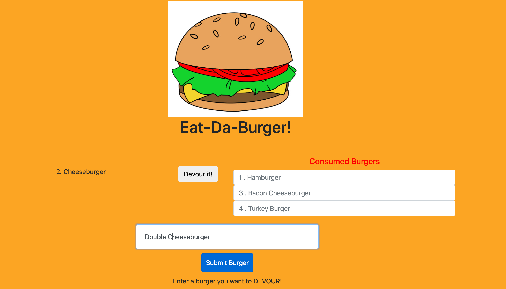
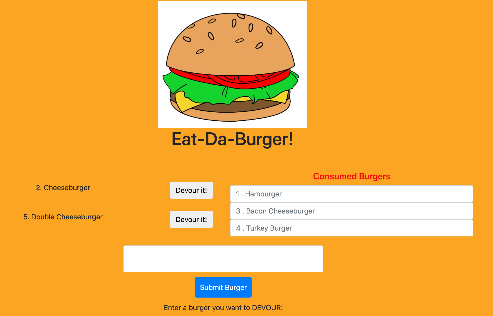
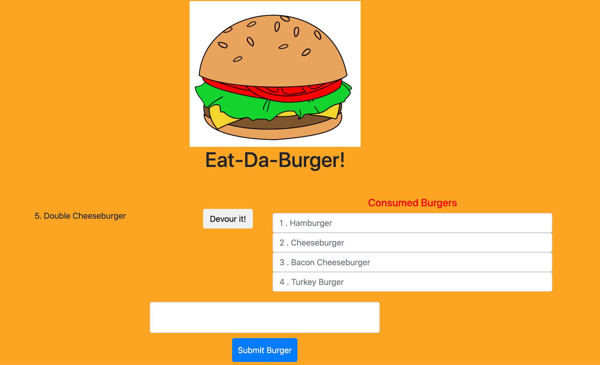

  # Eat-Da-Burger

  

  ## Description

Starting from scratch, this website utilized: MySQL, ORM, Handlebars, Javascript, CSS, node.js and several npm packages to capture the finished product. The objective was to use MySQL to create a database for burgers the user wants to eat, and allows them to 'devour' it whenever they want. 

Once the user chooses to devour the burger, it will render on the right side of the screen, along with all the other devoured burgers. Object Relational Mapping was required to orchestrate the functionality between Handlebars, MySQL and Javascript.

  ## Table of Contents

  * [Installation](#installation)

  * [Usage](#usage)

  * [License](#license)

  * [Contributing](#contributing)

  * [Tests](#tests)

  * [Questions](#questions)

  ## Installation
  To install the necessary dependencies, run the following command:
  
  npm i

  ## Usage
  
  [Deployed Link]

  ## License

  This project is not licensed

  ## Contributing

  [Joshua Homer](https://github.com/Jchomer90)

### Enter a burger you would like to eat

### It will save to MySQL and render on the left side of the screen

### Click 'Devour' to eat the burger, and move to the right side of the screen

  ## Questions
  If you have any questions about the repository, open an issue or contact me directly at Joshuachomer@gmail.com.
   You can also find more of my work on [Github](www.github.com/Jchomer90)
  